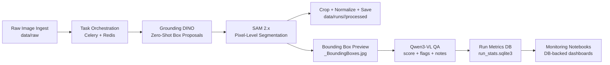

# Feather Molt Analysis Pipeline

A distributed feather segmentation pipeline for a scalable cluster of Celery workers using a Redis-backed task queue.

## Workflow Architecture


- Zero-shot object grounding: `Grounding DINO` uses text prompts (for example, `"bird feather."`) to propose feather boxes without task-specific training.
- Prompted segmentation: `SAM 2.x` refines detection boxes into pixel-level masks for feather cutouts.
- Vision-language quality checks: `Qwen3-VL` can score outputs and emit QA flags/notes (coverage, leakage, grouped boxes) into run metrics.
- Metadata extraction fallback: filename parsing is primary; VLM fallback can recover `bird_id` / date when filename metadata is incomplete.
- Distributed orchestration: Celery + Redis coordinates parallel per-image processing across a scalable cluster.

## Project Structure
- `data/raw/`: Input feather `.jpg` files.
- `data/processed/`: Output segmented feather crops.
- `src/full_run_distributed.py`: Dispatches all image tasks to the cluster.
- `src/celery_tasks.py`: Distributed task definitions.
- `src/feather_processing.py`: Core segmentation and extraction logic.
- `run_cluster.sh`: Bootstraps Redis, Celery workers, Flower, and starts the pipeline.

## Local Setup
1. Run `./setup_env.sh`
2. Activate env: `conda activate feather_env`

## Cluster Run
1. Ensure your SSH key and host IPs in `run_cluster.sh` are correct.
2. Place all feather images in `data/raw/`.
3. Launch cluster + pipeline:
   ```bash
   ./run_cluster.sh
   ```

## Monitoring
- Flower dashboard: `http://<head-ip>:5555`
- Pipeline log on head: `distributed_pipeline.log`
- Worker logs on each node: `celery_worker.log`

## Remote Notebook Orchestration (No Local Image Mirror)
You can run orchestration from a hosted notebook/kernel while keeping data and model execution on the cluster.

1. Point the notebook kernel to the cluster broker/backend:
   ```bash
   export BROKER_URL=redis://10.0.0.148:6379/0
   export RESULT_BACKEND=redis://10.0.0.148:6379/1
   ```
2. Submit work using remote paths (as seen by cluster workers), without copying `data/raw` locally:
   ```bash
   python -m src.submit_remote_pipeline \
     --host 10.0.0.148 \
     --user openteams \
     --key-path ~/.ssh/ubuntu-mac-openteams-admin \
     --remote-input-dir /Users/openteams/Feather_Molt_Project/data/raw \
     --remote-output-dir /Users/openteams/Feather_Molt_Project/data/processed
   ```

The notebook host acts as a control plane only. Celery workers do the heavy model inference.
