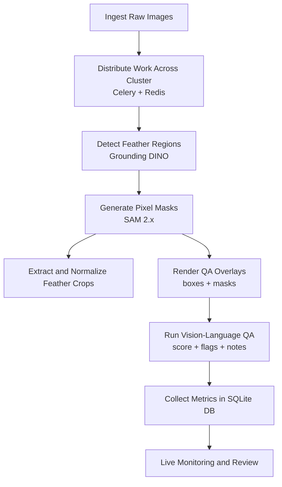

# Feather Molt Analysis Pipeline

A distributed feather segmentation pipeline for a scalable cluster of Celery workers using a Redis-backed task queue.

## Workflow Architecture


1. Ingest slide images and dispatch each image as an independent task to a scalable worker cluster.
2. Use zero-shot grounding (`Grounding DINO`) with text prompts to propose feather bounding regions without supervised retraining.
3. Use prompted segmentation (`SAM 2.x`) to convert proposed regions into pixel-level feather masks.
4. Post-process masks into clean feather crops, apply basic normalization, and persist run outputs.
5. Generate visual QA overlays and run vision-language assessment (`Qwen3-VL`) to score quality and detect failure modes such as grouped boxes, leakage, or incomplete coverage.
6. Parse specimen metadata from structured sources first, with VLM fallback when metadata is missing.
7. Persist per-image outcomes (timings, counts, QA flags, notes, retry decisions) into SQLite for queryable run history.
8. Drive dashboards and review notebooks from database state so monitoring is tied to recorded pipeline results, not transient filesystem scans.

## Project Structure
- `data/raw/`: Input feather `.jpg` files.
- `data/processed/`: Output segmented feather crops.
- `src/full_run_distributed.py`: Dispatches all image tasks to the cluster.
- `src/celery_tasks.py`: Distributed task definitions.
- `src/feather_processing.py`: Core segmentation and extraction logic.
- `run_cluster.sh`: Bootstraps Redis, Celery workers, Flower, and starts the pipeline.

## Local Setup
1. Run `./setup_env.sh`
2. Activate env: `conda activate feather_env`

## Cluster Run
1. Ensure your SSH key and host IPs in `run_cluster.sh` are correct.
2. Place all feather images in `data/raw/`.
3. Launch cluster + pipeline:
   ```bash
   ./run_cluster.sh
   ```

## Monitoring
- Flower dashboard: `http://<head-ip>:5555`
- Pipeline log on head: `distributed_pipeline.log`
- Worker logs on each node: `celery_worker.log`

## Remote Notebook Orchestration (No Local Image Mirror)
You can run orchestration from a hosted notebook/kernel while keeping data and model execution on the cluster.

1. Point the notebook kernel to the cluster broker/backend:
   ```bash
   export BROKER_URL=redis://10.0.0.148:6379/0
   export RESULT_BACKEND=redis://10.0.0.148:6379/1
   ```
2. Submit work using remote paths (as seen by cluster workers), without copying `data/raw` locally:
   ```bash
   python -m src.submit_remote_pipeline \
     --host 10.0.0.148 \
     --user cluster_user \
     --key-path ~/.ssh/ubuntu-mac-cluster_user-admin \
     --remote-input-dir ~/Feather_Molt_Project/data/raw \
     --remote-output-dir ~/Feather_Molt_Project/data/processed
   ```

The notebook host acts as a control plane only. Celery workers do the heavy model inference.
